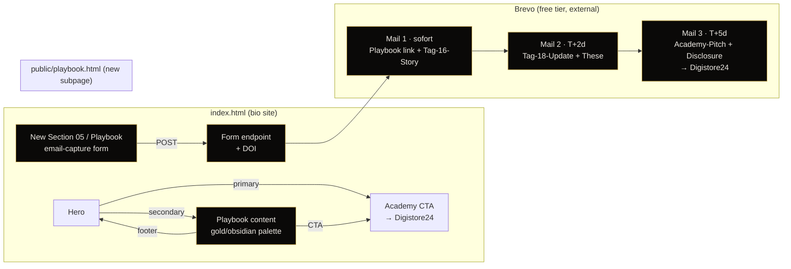

# Master Lead-Funnel — Plan

## Context

The bio site (`oskar778838.github.io/oskar-marketing`) currently routes every
visitor to one of two endpoints: the Mark-Janzen affiliate checkout (high
commitment, €397+) or a calendar booking (high friction). Tag 16, 7.600
Views/Woche, 0 Sales — the funnel is too narrow at the top.

This change adds two things and one connector:

1. A self-hosted **Playbook** subpage (lead magnet content, lives on the
   same origin, free to host).
2. An **email-capture section** on the bio site that feeds a 3-mail Brevo
   sequence (capture → educate → soft pitch with affiliate disclosure).
3. **Cross-linking** so the playbook also serves as a secondary CTA from
   the hero, and the playbook returns visitors to the bio.

Constraints carried throughout:
- €0/month: GitHub Pages + Brevo free tier. No Cloudflare Worker, no paid
  ESP, no premium fonts.
- Authenticity: no fabricated metrics, no hype, no FOMO. Mail 3 carries the
  legally-required affiliate disclosure (DE: §6 TMG / UWG).
- The playbook is a *single self-contained HTML file* with inline CSS+JS,
  served from `/public/` so Vite's rollup leaves it untouched.

## Prerequisites (blockers)

The brief assumes `reference/playbook_original.html` exists in the repo;
it does not. **User confirmed: they will push it before implementation.**
The plan below describes the diff against that file.

The Mark-Janzen "5 €" CTA from the brief is interpreted as a quoted CTA
label from the source playbook — kept verbatim, not changed by the
migration. (If the source uses a different CTA label, no action.)

## Architecture



Boxes outlined in gold are new; everything else already exists.

---

## Part 1 — Playbook subpage

Target file (after user pushes source): `reference/playbook_original.html`
→ becomes `public/playbook.html` (Vite copies `/public/*` verbatim, so
single-file inline CSS+JS deploys as-is, no rollup entry needed).

### 1.1 CSS variable migration

Inside `:root` block, exact replacements (literal `var(--orange)` usages
in the rest of the stylesheet need no change — they pick up the new gold
automatically):

| Token             | Old                          | New                          |
| ----------------- | ---------------------------- | ---------------------------- |
| `--bg`            | `#0A0A0A`                    | `#050505`                    |
| `--bg-alt`        | `#111111`                    | `#0A0908`                    |
| `--orange`        | `#FF6B1A`                    | `#C9A84C`                    |
| `--orange-light`  | `#FF8540`                    | `#E8C96A`                    |
| `--orange-dim`    | `rgba(255,107,26,0.1)`       | `rgba(201,168,76,0.1)`       |
| `--orange-glow`   | `rgba(255,107,26,0.4)`       | `rgba(201,168,76,0.4)`       |
| `--border-strong` | `rgba(255,107,26,0.3)`       | `rgba(201,168,76,0.3)`       |

Note: existing variable *names* stay (`--orange`, `--orange-light` etc.) to
keep the patch surgical. Renaming would mean rewriting every selector;
not worth the diff bloat.

### 1.2 Background reduction (less luxurious than bio site)

| Selector / property                          | Old           | New            |
| -------------------------------------------- | ------------- | -------------- |
| `.hero-bg` radial-gradient orbs `filter: blur(...)` | `80px`        | `50px`         |
| `.hero-bg` orb animation `duration`          | `15s`         | `25s`          |
| `.cta-section` pulse-glow keyframe opacity range | `0.5 → 1.0`   | `0.3 → 0.6`    |
| `.bridge-section` gradient stop              | `#1A0A05`     | `#0F0908`      |

Rationale: playbook = reading experience, bio = brand showcase.

### 1.3 Logo

`/public/logo.svg` already exists in this repo (gold OM monogram,
gradient `#E8C96A → #C9A84C`). Replace the placeholder square inside
`.logo-mark` with:

```html

```

Same-origin once deployed — no base64 needed. Existing `border-radius` /
sizing on `.logo-mark` stays; the `` sits inside it. The Windows
path from the brief (`C:\Users\Oskar\affiliate_autopilot\backgrounds\…`)
is not accessible from this environment and is not needed.

### 1.4 Affiliate disclosure microcopy

Insert directly **below** the existing CTA button (verbatim text, no
paraphrase — DE-Recht):

```html
<p class="cta-disclosure">
  Werbe-Hinweis: Affiliate-Link. Ich erhalte eine Provision wenn du
  startest. Das kostet dich nichts extra.
</p>
```

Add to the playbook's `<style>`:

```css
.cta-disclosure {
  margin-top: 12px;
  font-family: var(--font-mono, "JetBrains Mono", monospace);
  font-size: 9px;
  letter-spacing: 0.2em;
  text-transform: uppercase;
  opacity: 0.7;
  color: var(--orange-light); /* now gold-warm */
  text-align: center;
}
```

### 1.5 Faktische Behauptungen — Konservativisierung

The source playbook contains unverified Mark-Janzen quantitative claims.
Replace as follows (string-level edits inside the source):

| Old wording                          | New wording                              |
| ------------------------------------ | ---------------------------------------- |
| `350+ Mitglieder Community` *(or any "N+ Mitglieder" pattern)* | `wachsende, aktive Community`            |
| `85+ Schritt-für-Schritt Videos` *(or any "N+ Videos")*        | `umfassendes Video-Curriculum`           |
| Any other `\d+\+` quantitative academy claim                   | Replace with qualitative phrasing — flag for user review if uncertain |

If during implementation a number turns out to be officially documented
on Mark-Janzen's own checkout/landing pages: keep it. If unverifiable in
< 60s: convert to qualitative. **Never invent a replacement number.**

### 1.6 Deployment path

Do not add a Vite rollup input. Place the file at:

```
public/playbook.html
```

Vite copies everything in `public/` verbatim into `dist/` at build time
(see existing `public/datenschutz.html` and `public/impressum.html` for
precedent). The deployed URL is
`https://oskar778838.github.io/oskar-marketing/playbook.html`.

`vite.config.ts` requires **no edits**.

`.nojekyll` and `.github/workflows/deploy.yml` already do the right
thing — push triggers redeploy.

### 1.7 SEO + meta + JSON-LD

Inside the playbook's `<head>`:

```html
<meta name="description"
      content="Affiliate Marketing Playbook 2026. 4 Schritte für deinen Start. Kostenlos." />
<link rel="canonical"
      href="https://oskar778838.github.io/oskar-marketing/playbook.html" />

<meta property="og:type" content="article" />
<meta property="og:url"
      content="https://oskar778838.github.io/oskar-marketing/playbook.html" />
<meta property="og:title" content="Affiliate Playbook · oskarmarketing" />
<meta property="og:description"
      content="4 Schritte für deinen Affiliate-Start. Build in Public, dokumentiert." />
<meta property="og:image" content="./og-image.svg" />
<meta name="twitter:card" content="summary_large_image" />

<script type="application/ld+json">
{
  "@context": "https://schema.org",
  "@type": "HowTo",
  "name": "Affiliate Marketing Playbook 2026",
  "description": "4 Schritte für den Affiliate-Start.",
  "step": [
    { "@type": "HowToStep", "position": 1, "name": "{Schritt 1 aus Source-Playbook}" },
    { "@type": "HowToStep", "position": 2, "name": "{Schritt 2 aus Source-Playbook}" },
    { "@type": "HowToStep", "position": 3, "name": "{Schritt 3 aus Source-Playbook}" },
    { "@type": "HowToStep", "position": 4, "name": "{Schritt 4 aus Source-Playbook}" }
  ]
}
</script>
```

Step names are filled from the actual section headings inside the source
file at implementation time — leaving placeholders here would push that
research onto a future reader.

---

## Part 2 — Lead-Capture-Funnel

### 2.1 New section on bio site

Insert **between `#termin` (04) and `#social` (current 05)** in
`index.html`. Section is labeled `05 / Playbook` and the existing
sections renumber: Channels 05→06, Manifest 06→07. (User's brief said
"07 / PLAYBOOK" — that matches the *final* count, but the *position*
between Termin and Channels makes it the new 05; renumbering the rest
keeps the editorial chapter order monotonic.)

Markup follows the existing section pattern (compare `#academy`,
`#termin`):

```html
<section id="playbook" class="playbook" aria-labelledby="playbook-h">
  <span class="section-vlabel" aria-hidden="true">Playbook · 05</span>
  <div class="container playbook__inner">
    <header class="playbook__head">
      <span class="section-label">05 / Playbook</span>
      <h2 id="playbook-h" class="playbook__h t-display">
        <span data-split>Bevor du buchst</span>
        <span class="t-display-italic" data-split>nimm das Playbook</span>
      </h2>
      <p class="playbook__sub">
        Mein komplettes Affiliate-Marketing-System als Playbook.
        Kostenlos, sofort per Email. Kein Spam.
      </p>
    </header>

    <form class="playbook__form" data-brevo-form novalidate>
      <div class="field">
        <label for="pb-email" class="t-mono">Email</label>
        <input id="pb-email" name="EMAIL" type="email" required
               autocomplete="email" inputmode="email"
               placeholder="du@example.com" />
      </div>

      <label class="consent">
        <input id="pb-consent" name="OPT_IN" type="checkbox" required value="1" />
        <span class="consent__text">
          Ich stimme zu dass meine Email-Adresse von Brevo (Sendinblue
          SAS) zur Versendung von Marketing-Inhalten verarbeitet wird.
          Widerruf jederzeit möglich.
          <a href="./datenschutz.html" target="_blank" rel="noopener">Datenschutz</a>.
        </span>
      </label>

      <button type="submit" class="cta cta--track" data-magnetic data-cursor-hover>
        <span class="cta__label">Playbook holen</span>
        <span class="cta__arrow" aria-hidden="true">
          <svg viewBox="0 0 24 24" fill="none" width="18" height="18">
            <path d="M5 12h14M13 6l6 6-6 6" stroke="currentColor"
                  stroke-width="1.4" stroke-linecap="round" stroke-linejoin="round"/>
          </svg>
        </span>
        <span class="cta__shimmer" aria-hidden="true"></span>
      </button>

      <p class="playbook__privacy t-mono">
        Brevo verarbeitet DSGVO-konform. Du trägst dich mit einem Klick wieder aus.
      </p>

      <p class="playbook__success" hidden data-success>
        Check deine Inbox. Das Playbook ist unterwegs.
      </p>
      <p class="playbook__error" hidden data-error></p>
    </form>
  </div>
</section>
```

Form scaffolding follows the existing `.booking__form` / `.consent`
pattern from `index.html:429-486` so existing CSS in
`src/styles/booking.css` covers most of it. Add a minimal
`.playbook__*` block to `src/styles/sections.css` (small additive
chunk — sub-100 lines).

### 2.2 Submit logic — Brevo embed (Option A)

Approach: **custom-styled form that POSTs to Brevo's form action URL**.
This keeps the editorial aesthetic and avoids loading Brevo's stock CSS.

Implementation:

1. User creates a Brevo Web Form in their dashboard (see 2.4 setup doc).
2. Brevo gives a `<form action="https://...sibforms.com/serve/...">` URL.
3. Replace `data-brevo-form` with `action="{{BREVO_FORM_ACTION}}"
   method="POST"` once user supplies the URL.
4. Add a single hidden `<input type="hidden" name="locale" value="de">`
   plus any other hidden fields Brevo's snippet provides (token,
   list ID).
5. Tiny inline `<script>` in `index.html` (or extracted to
   `src/lib/playbookForm.ts`) intercepts the submit, fetches via
   `fetch(action, {method:'POST', body: new FormData(form), mode:'no-cors'})`,
   then toggles `data-success` / `data-error` paragraphs.
   `mode: 'no-cors'` is required because Brevo's endpoint doesn't return
   CORS headers; we accept the opaque response and rely on Brevo's
   double-opt-in email as the actual confirmation channel.

Fallback if scripted submit ever fails: native form submission still
works (`action`/`method` set), just navigates to Brevo's thank-you page.

No Cloudflare Worker, no API key in the frontend, no monthly cost.

### 2.3 3-Email-Sequenz (drafts as `docs/email-sequence/mail-{1,2,3}.md`)

Full text below — copy verbatim into the Brevo automation editor.
Tonality: build-in-public, no fake numbers, no FOMO. Length per spec.

---

**`docs/email-sequence/mail-1.md`** — Trigger: sofort nach DOI-Bestätigung

```
Subject: Dein Playbook ist da. Plus: das hier kommt zuerst.

Hi,

danke. Hier ist dein Playbook:
https://oskar778838.github.io/oskar-marketing/playbook.html

Bevor du klickst — eine Sache vorab.

Ich schreib das aus Tag 16. 7.600 Views/Woche. 60 Posts live. Sales: 0.

Klingt schief? Ist es nicht. Das ist genau der Punkt an dem die meisten
aufgeben — und an dem das System anfängt zu greifen, wenn man
durchhält. Das Playbook beschreibt was ich seit Tag 1 gemacht hätte,
wenn ich nochmal von vorne anfangen müsste.

Eine Sache die nicht im Playbook steht: Ich hätte am ersten Tag nicht
drei Plattformen parallel angefasst. Nur eine. Volle Kraft. Die
anderen erst, wenn die erste läuft.

Lies das Playbook und antworte mir auf diese Mail mit der ersten Frage
die hochkommt. Ich les jede.

— Oskar, Tag 16
   Build in Public
```

(~190 Wörter)

---

**`docs/email-sequence/mail-2.md`** — Trigger: 2 Tage nach Anmeldung

Quantitative Selbstreport-Claims wurden bewusst durch qualitative
Formulierungen ersetzt — Mails laufen evergreen in der Brevo-Automation
und sollen nicht mit veralteten Zahlen altern.

```
Subject: Tag 18. Eine These die ich gerade teste.

Update.

Seit Mail 1 sind zwei Tage vergangen. Tag 18 jetzt. Reichweite stabil
im 4-stelligen Bereich pro Woche. Sales weiterhin 0.

Aber: das Engagement-Pattern auf TikTok hat sich gedreht, nachdem ich
aufgehört habe Hooks zu verwenden die "viral funktionieren sollen".
Stattdessen: konkrete Zahlen und Fragen die nur ich beantworten kann.

These die ich teste: Reichweite ohne Engagement ist Statistik-Müll.
Echte Kommentare schlagen Vanity-Views.

Was ist bei dir passiert seit du das Playbook gelesen hast? Welche
Stelle hat geklickt — und welche nicht?

Hintergrund: ich gehe gerade selbst eine Academy durch. Mehr dazu in
der nächsten und letzten Mail. Falls dich das Setup nicht interessiert:
einfach diese Mail ignorieren.

— Oskar, Tag 18
```

(~155 Wörter)

---

**`docs/email-sequence/mail-3.md`** — Trigger: 5 Tage nach Anmeldung

```
Subject: Letzte Mail — danach hörst du nur, wenn du willst

Letzter automatischer Touchpoint. Versprochen.

Ich hab in den letzten zwei Mails erwähnt, dass ich selbst eine
Academy durchgehe. Das ist die Mark Janzen Affiliate Academy.

Zwei Pakete:

— Plus, 397 €
  Step-by-Step Plan, private Community, 1× wöchentlich Group-Coaching,
  2 Monate Coaching-Phase.

— Pro, 830 €
  Alles vom Plus plus intensiveres Mentoring-Setup.

Was ich konkret rausziehe: Struktur. Die ersten zwei Wochen alleine
hätten mir zwei Monate Trial-and-Error erspart, wenn ich von Anfang
an drin gewesen wäre.

Wenn das nichts für dich ist:
— wenn du bereits 3+ Monate konstant postest und Verkäufe machst
— wenn dein Budget unter 400 € ist und enger als das schmerzt
— wenn du gegen strukturierte Programme ein generelles Veto hast

Dann lass es. Kein Drama.

Falls du startest, hier der Link:
https://www.checkout-ds24.com/product/583562?aff=Bestproducts99978

Werbe-Hinweis: Affiliate-Link. Ich erhalte eine Provision wenn du
startest. Das kostet dich nichts extra.

Wenn nicht jetzt, kein Problem. Du bleibst auf der Liste. Ich melde
mich nur, wenn ich etwas Wichtiges habe.

— Oskar
```

(~225 Wörter)

---

### 2.4 Brevo setup doc — `docs/BREVO-SETUP.md`

Step-by-step the user follows in the Brevo dashboard (Claude can't
automate this — needs UI):

1. `brevo.com` → Sign Up mit `opheck@gmx.de`.
2. Email-Verifizierung (Brevo schickt Code).
3. **Contacts → Lists → Create List**: Name = `Affiliate Funnel`.
4. **Forms → Create form** (Embed type):
   - Felder: Email (required), Hidden GDPR-Consent.
   - List target: `Affiliate Funnel`.
   - Double-Opt-In aktivieren (Pflicht in DE).
   - DOI-Bestätigungs-Template anpassen: Sender = Oskar, Subject = "Bitte bestätige deine Anmeldung".
5. Snippet copy: nur die `<form action="...">`-URL übernehmen — der Rest des HTML wird durch unser Markup ersetzt.
6. URL einsetzen in `index.html` an der Stelle `{{BREVO_FORM_ACTION}}`.
7. **Automations → Create automation**:
   - Trigger: `Contact added to list "Affiliate Funnel"` (post-DOI).
   - Step 1: Send email — paste `mail-1.md` body + subject.
   - Step 2: Wait `2 days`.
   - Step 3: Send email — paste `mail-2.md`.
   - Step 4: Wait `3 days` (so Mail 3 = T+5 from signup).
   - Step 5: Send email — paste `mail-3.md`.
8. Test: eigene Email eintragen → DOI bestätigen → 3 Mails über 5 Tage validieren.
9. Brevo-Sender-Verifizierung (SPF/DKIM): Anleitung in der Brevo-UI folgen, falls eigene Domain genutzt wird; bei `gmx.de`-Versand reicht Brevo-Default-Verifizierung.

### 2.5 Datenschutz-Update — `public/datenschutz.html`

Add Brevo as a sub-processor under `<h2>5. Auftragsverarbeiter</h2>`.
Insertion point: after the existing GitHub block, before
`<h2>6. Deine Rechte</h2>`. New `<h3>` block:

```html
<h3>Sendinblue SAS (Brevo)</h3>
<p>
  Versand des Lead-Magnet-Playbooks und der nachfolgenden 3-Mail-Sequenz
  bei Anmeldung über das Email-Formular.<br />
  Sitz: Frankreich (EU) · Datenverarbeitung innerhalb der EU.<br />
  Datenschutzerklärung:
  <a href="https://www.brevo.com/legal/privacypolicy/" target="_blank"
     rel="noopener">brevo.com/legal/privacypolicy</a>
  · Auftragsverarbeitungsvertrag (DPA) abgeschlossen.
</p>
<p style="font-size:13px;color:var(--muted);">
  Speicherdauer: bis zur Austragung durch dich oder maximal 24 Monate
  Inaktivität. Jeder Mail liegt ein Unsubscribe-Link bei (von Brevo
  automatisch eingefügt). Keine Weitergabe an Dritte.
</p>
```

Also extend `<h2>3. Wofür verwende ich diese Daten?</h2>` with one
sentence:

```
Wenn du dich über das Playbook-Formular einträgst, verwende ich deine
Email-Adresse zusätzlich, um dir das Playbook plus eine 3-teilige
Mail-Sequenz zuzustellen. Du kannst dich jederzeit per Klick im Mail-
Footer austragen.
```

---

## Part 3 — Cross-linking

### 3.1 Hero secondary CTA

In `index.html` around the existing primary CTA wrap (line 212-222),
add a sibling link **inside** `.hero__cta-wrap--editorial`:

```html
<a href="./playbook.html"
   class="cta cta--ghost"
   data-cursor-hover>
  <span class="cta__label">Playbook lesen</span>
  <span class="cta__arrow" aria-hidden="true">→</span>
</a>
```

`.cta--ghost` modifier added to `src/styles/sections.css`: smaller font,
no shimmer, no magnetic, mono caps, gold-warm border at 1px, transparent
fill. Visually subordinate to the gold-filled primary academy CTA.

### 3.2 Playbook footer back-link

Inside the playbook source's footer section (whatever it's called in the
source — likely `.footer` or `<footer>`), add discreet:

```html
<a href="./" class="footer-back">← Zur Hauptseite</a>
```

Styling additive in the playbook's existing `<style>`:

```css
.footer-back {
  font-family: var(--font-mono, "JetBrains Mono", monospace);
  font-size: 11px;
  letter-spacing: 0.2em;
  text-transform: uppercase;
  color: var(--orange-light); /* gold-warm */
  text-decoration: none;
  opacity: 0.7;
  transition: opacity 180ms ease;
}
.footer-back:hover { opacity: 1; }
```

### 3.3 Section-indicator + nav-dropdown updates

Touched by the new section between Termin and Channels:

- `src/lib/sectionIndicator.ts:11-19` — `SECTIONS_BIO` array: insert
  `{ selector: "#playbook", num: "05", label: "Playbook" }` after Termin;
  bump Channels to `06`, Manifest to `07`.
- `index.html:158-167` — `.nav-dropdown__list`: insert `<li>` for
  Playbook after Termin (`05`), bump Channels (`06`) and Manifest (`07`)
  numbers + `data-nav-target` stays the same.
- `index.html` `section-vlabel` and `section-label` strings on Channels
  and Manifest sections: bump 05→06 and 06→07.

---

## File map

| Path                                  | Action  | Purpose                                            |
| ------------------------------------- | ------- | -------------------------------------------------- |
| `reference/playbook_original.html`    | (read)  | Source — provided by user before implementation    |
| `public/playbook.html`                | create  | Migrated playbook (CSS vars + bg + logo + disclosure + claims + meta + back-link) |
| `index.html`                          | edit    | Add section 05 Playbook; renumber 05→06, 06→07; add ghost CTA in hero |
| `src/styles/sections.css`             | edit    | Add `.playbook__*` and `.cta--ghost` styles        |
| `src/lib/sectionIndicator.ts`         | edit    | Insert Playbook into `SECTIONS_BIO`, renumber tail |
| `src/lib/playbookForm.ts`             | create (optional) | Submit handler if extracted from inline; otherwise inline `<script>` in index.html |
| `src/main.ts`                         | edit (only if 2.2 extracted to module) | Wire `initPlaybookForm()` |
| `public/datenschutz.html`             | edit    | Add Brevo as Auftragsverarbeiter; extend §3        |
| `docs/email-sequence/mail-1.md`       | create  | Mail 1 draft (verbatim above)                      |
| `docs/email-sequence/mail-2.md`       | create  | Mail 2 draft                                       |
| `docs/email-sequence/mail-3.md`       | create  | Mail 3 draft                                       |
| `docs/BREVO-SETUP.md`                 | create  | Step-by-step setup the user runs in Brevo UI       |
| `vite.config.ts`                      | (none)  | No change — `public/` files copied verbatim        |
| `.github/workflows/deploy.yml`        | (none)  | No change                                          |
| `public/sitemap.xml`                  | edit (small) | Add `<url><loc>.../playbook.html</loc></url>` |

Existing patterns being reused (no new abstractions introduced):

- Form layout / `.field` / `.consent` markup from `index.html:439-486`.
- `.cta--track` button with magnetic + shimmer (already covers our submit button).
- `.section-label`, `.section-vlabel`, `data-split` reveal hooks — all reused.
- Static legal subpage layout from `public/datenschutz.html` precedent — proves Vite `public/`-only deploy works.

---

## Verification

After implementation, manual smoke-test in this order:

1. `npm run build` succeeds; `dist/playbook.html` exists with inline CSS+JS intact.
2. Local `npm run preview` then visit `http://localhost:4173/playbook.html`:
   - Gold/obsidian palette rendered (no orange).
   - Logo renders from `./logo.svg`.
   - "Werbe-Hinweis" disclosure visible under CTA.
   - Footer back-link returns to `/`.
   - Quantitative Mark-Janzen claims either verified or qualitative.
3. `http://localhost:4173/`:
   - Section 05 Playbook visible between Termin and Channels.
   - Section indicator and nav-dropdown both show updated numbering.
   - Hero secondary CTA "Playbook lesen →" present, visually subordinate.
   - Form: empty submit blocked by browser validation; consent box required.
4. Brevo end-to-end (after user runs `BREVO-SETUP.md` steps):
   - Submit form with own email → DOI mail arrives → confirm → Mail 1 within ~1 min.
   - Calendar simulate: Mail 2 at +2d, Mail 3 at +5d.
   - Each mail has working unsubscribe link in footer.
5. Datenschutz: `http://localhost:4173/datenschutz.html` shows Brevo block under §5; §3 extended.
6. Lighthouse on `/playbook.html`: still ≥ 90 perf (single-file inline keeps it fast).
7. After push: GitHub Action builds and deploys; check
   `https://oskar778838.github.io/oskar-marketing/playbook.html` loads.

Acceptance: visitor on bio site can hit Playbook section → enter email →
receive Playbook link → 3 mails over 5 days → final mail contains
Mark-Janzen affiliate link with disclosure. €0 monthly cost confirmed.